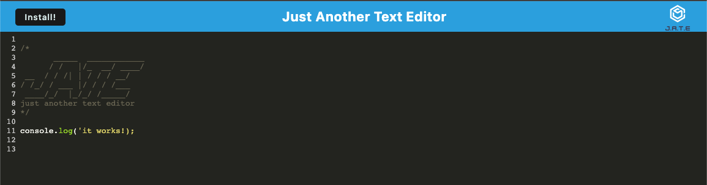

# JATE_textED.

 

## Description
JATE_textED is a text editor that runs in the browser, and can be installed to run locally on your machine!

 
 
 

## Table of Contents

* **[Installation](#installation)** 
* **[Usage](#usage)** 
* **[License](#license)** 
* **[Contributing](#contributing)** 
* **[Contact](#contact)** 

### Installation
<a name="installation"/>

navigate to <a href="jate-texted.herokuapp.com">jate-texted.herokuapp.com</a> and click the install button!

### Usage
<a name="usage"/>
You don't really need to know much, just open the app, whether in the browser or, if installed, locally. Then type and edit your text as you please! 

 

### License
<a name="license"/>

<a href="https://choosealicense.com/licenses/isc/">isc</a> 
            For more information on the coverage of this license please click on the link above.

### Contributing
<a name="contributing"/>
hackpres is the primary contributor.

### Contact
<a name="contact"/>
for questions please contact <a href="https://github.com/hackpres">hackpres</a> 

